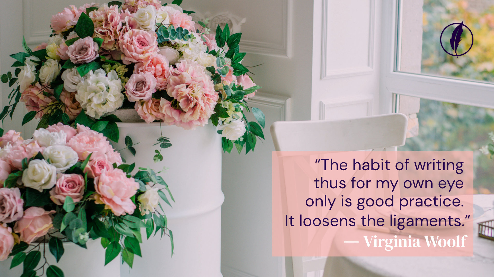

### Journals offer a window into the soul. Writers’ journals, which are often published, offer a reader a chance to gaze through that window.

Writers’ journals have long been a source of intrigue for fellow writers and fans of writing alike. As Dustin Illingworth [wrote in a Lithub article](https://lithub.com/on-the-journals-of-famous-writers/) about his deep connection to the journals of some writers,

> *“A writer’s diary has often functioned as an archive for the overheard remark, the potent anecdote, the physical description that begs for inclusion in the next novel. James Salter wrote on napkins during dinner parties; Victor Hugo reportedly kept a journal on his knee beneath the table. The journal, too, has a way of embodying a kind of necessary absence at the heart of a writing practice, the shadow to the novel’s shine.”*

For people for whom writing is a vehicle for the soul, the journal is an indispensable tool. It is a place where the writer can explore expression in the written form — try phrasing, ideas, or capture observations to be used in writing later. Ralph Waldo Emerson famously referred to his journal as “the savings bank.” In it, he collected his thoughts and observations of his daily life — meanderings he could come back to when writing essays or sermons. This type of record keeping is the fuel for many a writer’s work, whether it be memoir, essay, fiction, or other forms of narrative writing like plays, screenplays, and experimental works. By capturing one’s thinking in the moment, a portrait exists of a particular form of expression.

In reading the journal of a famous writer, a present-day writer may glean more than just portraits of expression. Seeing how a writer related to him or herself, or to the written word, when it was not being crafted for consumption but rather was a private entity and exploration, can give a writer pause and, perhaps, some instruction. Seeing how deeply these experienced writers relate to their chosen form of expression even when no one is watching can be a thing to be in awe of, take inspiration from, and feel creatively fulfilled by.

So, what journals are out there for the taking? Below is a list of a few of the famous writers’ journals that are available for reading.

## Virginia Woolf

*“I got out this diary and read, as one always does read one’s own writing, with a kind of guilty intensity. I confess that the rough and random style of it, often so ungrammatical, and crying for a word altered, afflicted me somewhat,”* wrote Virginia Woolf in her own journal in 1919. What writer can’t relate? Woolf shares other thoughts throughout her now-published journal, [A Writer’s Diary](https://www.amazon.com/A-Writers-Diary-Virginia-Woolf/dp/0156027917/flavorpill0e-20?ots=1&tag=bustle-20&linkCode=w50).

Diarly on [Twitter](https://twitter.com/DiarlyApp/status/1256476244981366789), [Instagram](https://www.instagram.com/p/B_rQy9An54V/), [Facebook](https://www.facebook.com/DiarlyApp/photos/a.127579025512119/138996304370391/?type=3&eid=ARAGpzFMFms4AtM6ZU5EqhG0giz1JtE37B_RpHplR6Eo3OcZ0wZEUZ_86gCHomfjjumUmAUpVz4-WjQC&__tn__=EEHH-R) on May 2, 2020.

## Ralph Waldo Emerson

In the aforementioned “[savings bank](https://www.amazon.com/Ralph-Waldo-Emerson-Selected-1820-1842/dp/1598530674/ref=sr\_1\_2?dchild=1&keywords=Ralph+waldo+emerson+journals&qid=1595969916&s=books&sr=1-2),” Emerson wrote, *“I find myself often idle, vagrant, stupid, and hollow. This is somewhat appalling and, if I do not discipline myself with diligent care, I shall suffer severely from remorse and the sense of inferiority hereafter. All around me are industrious and will be great, I am indolent and shall be insignificant.”* It can be both humbling and inspiring to read these words nearly 200 years after they were written in 1822 with the awareness that Emerson did not indeed prove to be insignificant. The knowledge that he was so convinced he would be, though, may give writers some much-needed fuel.

## Joan Didion

*“Why did I write it down? In order to remember, of course, but exactly what was it I wanted to remember? How much of it actually happened? Did any of it? Why do I keep a notebook at all? It is easy to deceive oneself on all those scores. The impulse to write things down is a peculiarly compulsive one, inexplicable to those who do not share it, useful only accidentally, only secondarily, in the way that any compulsion tries to justify itself.”* These are some of the musings in Didion’s “On Keeping a Notebook,” a stream-of-consciousness journal piece that appears in her 1961 collection of essays, [Slouching Towards Bethlehem](https://www.amazon.com/Slouching-Towards-Bethlehem-Essays-Classics/dp/0374531382/flavorpill0e-20?ots=1&tag=bustle-20&linkCode=w50).

## C S Lewis

Lewis’s journal-style reflection, [A Grief Observed](https://www.amazon.com/Grief-Observed-C-S-Lewis/dp/0060652381/flavorpill0e-20?ots=1&tag=bustle-20&linkCode=w50), was written after his wife died. Therein, he writes, *“Are these jottings morbid? Part of every misery is, so to speak, the misery’s shadow or reflection: the fact that you don’t merely suffer but have to keep on thinking about the fact that you suffer. I not only live each endless day in grief, but live each day thinking about living each day in grief. Do these notes merely aggravate that side of it? Merely confirm the monotonous, treadmill march of the mind round one subject. But what am I to do? I must have some drug, and reading isn’t a strong enough drug now.”*

Diarly on [Twitter](https://twitter.com/DiarlyApp/status/1263001568980467712), [Instagram](https://www.instagram.com/p/CAZvY4pgDxB/), [Facebook](https://www.facebook.com/DiarlyApp/photos/a.127579025512119/145705733699448/?type=3&eid=ARCRoWfwQWlfWMht3-sTghx35o_NmMyz42q32-WL6FcWKOaKh93CNx-I8TozjlvH4zZ1FPR69z2X8cAf&__tn__=EEHH-R) on May 20, 2020.

Writers’ journals, and their honest introspection, offer us a window into that which may otherwise be kept secret — the inner-workings of the mind of a writer. It’s a unique way to think about our own journals, too. A capture of our thoughts, the way we approach those thoughts, and our relationship to the written word.
