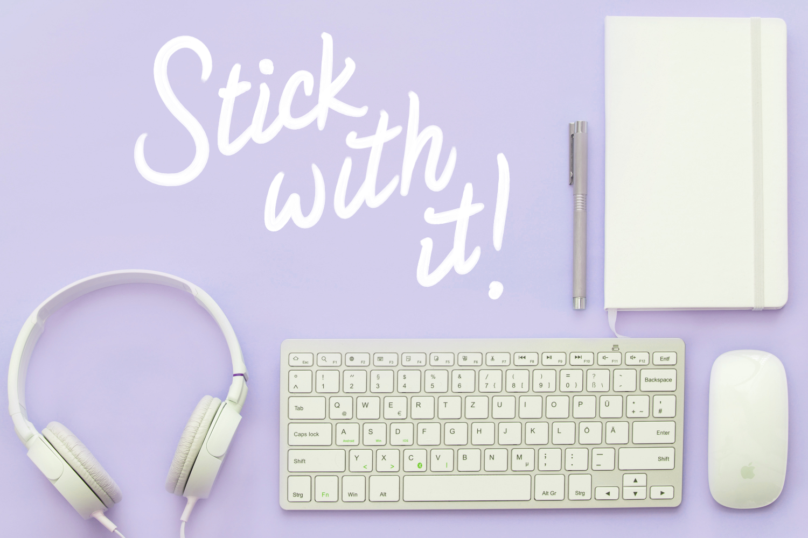

<!--  -->

Writing a journal can be a very rewarding experience. In addition to being a practical way to log activities, it can help you in numerous ways. However, it does require more than a little personal motivation, which is where many people falter.

Journaling is great, and we want to help you succeed, so here are our 5 biggest recommendations to ensure you stay the course and have a joyful experience at the same time!

## Why do you want to write a journal?

Really, “how to start a journal and stick with it” is the second part of the question — the first part is “why do you want to write a journal?”.

Understanding why you want to write is the best path to staying motivated and consistent. Whether its for personal reasons, professional reasons or simply a creative experiment, it’s good to remind yourself why you’re doing it. There will be days that just aren’t as exciting and this is when you need that little extra push.

Some people, for example, like to write to unleash thoughts and clear the head. Others want to track progress and look back on their former selves, while others still use it to note their day (meetings, shopping lists, self-reminders etc). Journaling is a very diverse medium!

### 1: Set Regular Goals

The key to any journal or diary is consistency. Regular writing is essential, so that means setting yourself some objectives. Depending on why you’re journaling, this could be daily or weekly, but it’s important to set something in line with your expectations.
However, as far as goals go, you need to be a little careful here. It’s important to write — yes, of course! — but word count might not always be a useful goal.
As an added incentive, what about offering yourself rewards? Commit yourself to a weekly indulgence if you hit all of your targets, for example. A little motivation now and then never hurt anybody.

### 2: Routine Rituals

In the past, some of the best advice has been to have a dedicated writing space, such as a desk, favorite cozy corner or even just a spot on the couch. However, in today’s busy world, that’s not always the easiest option.

What is important, however, is to set your self rituals that work with your life. Let them become a daily part of everything you do, rather than a burden you’re trying to make room for.

For example:

- Have time between work and dinner? Try writing.
- How about at the end of the evening? Unload your thoughts before going to bed.
- Commuting to work? Turn this into writing time!
- If you’re writing about specific events, find time straight away to get your immediate thoughts down.

These days, people always carry a mobile phone (with an awesome journal app) or a pen and notepad (if you’re old-school). If you can’t find the space for writing, take the writing with you!

### 3: Write Thoughts Down

If you’re having a busy, stressful or emotional day, your head is often full of thoughts. But thoughts don’t stay in your head forever. If they’re important, you should get in the habit of writing them down sooner, rather than later.

If you’ve ever had a phone call and been asked to do something, only to forget 2 hours later, you already know the feeling. Don’t you wish you had written it down?

Furthermore, you could also do this multiple times throughout the day. If you have a very important day, such as multiple meetings, gatherings or events, don’t wait until the end. If you have something you need to write down, do it! Let the journal become second-nature to your immediate thoughts.

### 4. Have A (Rough) Template

A blank canvas is always the most intimidating — because the first brush stroke is the most difficult to decide. It’s the same with writing.

When you’re covering similar topics, it helps to formulate a crude template to help nudge you in the right direction. Once you start writing, you’ll find the words just flow.

For example, let’s say you’re a programmer and you want a journal for developer logs. Well, if you’re journaling every meeting or update, there’s probably some key information that always needs to be covered (meeting, date, number of people, key topics etc). Turn this into a template.

### 5. Write Now, Edit Later

On a similar note, it’s always better to write something than nothing at all. After all, it’s your journal, so nobody will see it if you don’t want them to.

Plus, you can always edit the work later. Capturing your immediate thoughts is often better. Many seasoned writers work this way by letting their thoughts flow. Rather than break this creative bout, they prefer to save the analytical side for later, when they view it with renewed perspective.

### There you go!

So, you want to know how to start a journal and stick with it? Just follow these 5 steps:

1. Set regular goals
2. Make it a routine ritual
3. Write thoughts down
4. Have a template
5. Write now and edit it later

It really is that simple. If you have the willpower and creative spark to succeed, creating a journal will be a very joyful experience. Of course, the right tools can help — whether it’s a journal app or an old-fashioned book. Whatever works for you!
