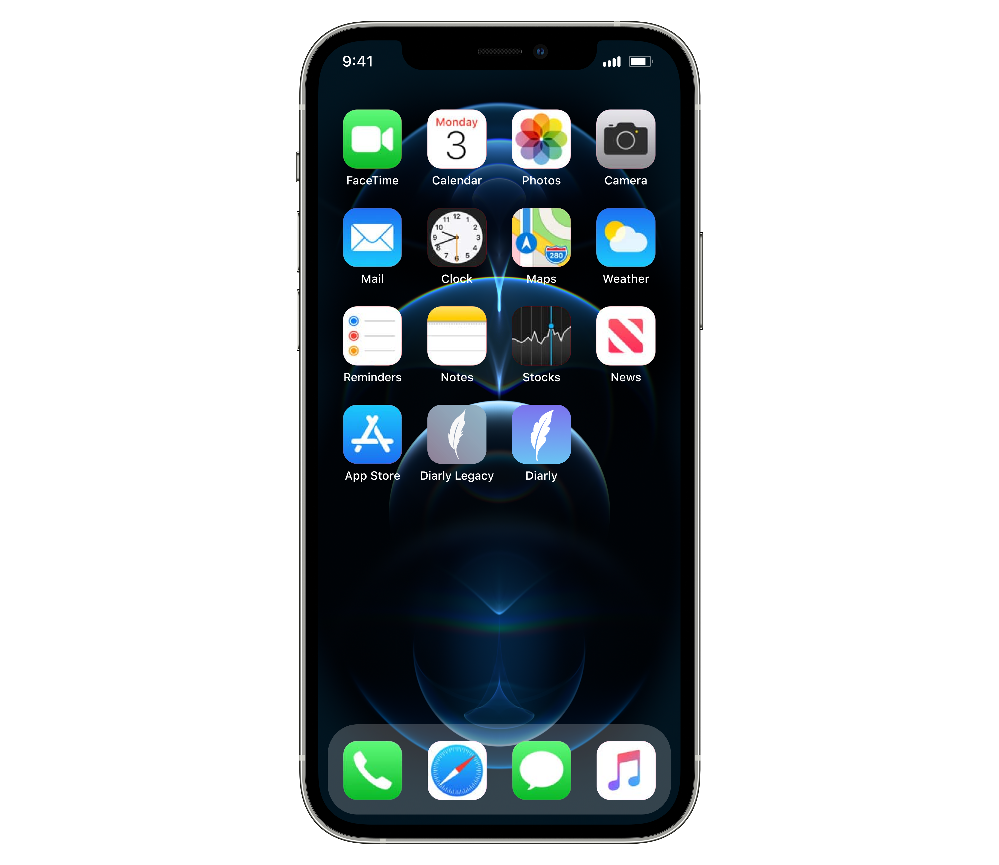

This week, a new version of Diarly for iOS will be released. You may notice the name is now "Legacy" and the icon has changed, and you might be wondering why. In the app, you will be asked to migrate your data to a new app. What is going on?

In this blog post, we want to make sure we're clear about what's happening, why we're migrating to a new app, what that means to your data, and answer all the doubts you may have.

## Why are you doing this?

We started Diarly as two separate applications: one for Mac, and one for iOS. Since then, a lot has changed — what used to be two different App Stores has now become one. We want Diarly to be represented as one app available for all devices.

Starting this week, you will find two Diarly apps on the iOS App Store available for iPhone and iPad: **Diarly** and **Diarly Legacy**.

It was not an easy decision, we had more than 600 reviews in the legacy app which will now be removed. But we think that's the best way forward. Apple now allows apps under one "umbrella" to share purchases, which will make purchases more robust, without the need for iCloud enabled. Furthermore, Diarly will be properly represented on the AppStore as one app available for both Mac & iOS.

> If you reviewed Diarly for iOS in the past, we would really appreciate if you add your review to the new app once you've migrated your data. It will only take a few minutes, and will be really helpful to get the new app up to speed!

### Is the app still the same?

Yes, the iOS app is exactly the same as the one you already use daily. Nothing has changed, other than a sleek new icon and a more streamlined app experience — without the confusion of having different apps for different devices.

We will continue to update and grow the app with new features and improvements on a regular basis, so please let us know if you have any feedback for us! You can always reach out via email and social media — the links are at the bottom of this page.

### What does it mean for me?

You'll need to install the new app and migrate your notes. We've boiled it down to three simple steps:

1. **Prepare your data for migration**. In this step, Diarly will bundle up all your notes, settings, and content into a single package that's ready to be moved to the new app. This bundle is saved on your device, and only accessible by the new Diarly App.
2. **Install the new app from the App Store**. Now you will be taken to the App Store, where you can download and install the new app.
3. **Open the new app, and wait for the migration to finish automatically.** The new Diarly app will now take the bundle created in step 1, and import it automatically. Once the import process finishes, you'll find all your notes, data, and preferences have been successfully migrated.

Once the migration is complete and you have verified that your data is present in the new app, you can safely uninstall Diarly Legacy.

### Will I lose any data?

Absolutely not — keeping your data safe and private is our number 1 priority.

If you use iCloud Sync, you already have all your data backed up safely. If you don't have iCloud sync enabled, we will bundle all the files into a backup package, and transition the data on one device. You will be able to verify that your data has been migrated properly before uninstalling Diarly Legacy.

### How long will the migration take?

Depending on the amount of files, it can take from few seconds to a few minutes to prepare your data for migration, and to import the data into the new app.

### What if I don't have a premium subscription?

We've made the process work for free users as well as premium users. In fact, if you're a free user, you will get another 7-day free trial!

### What if I have premium subscription?

Your subscription will be still valid until it expires. If you purchased a subscription on the iOS app, it will no longer auto-renew.

### Will I have to re-purchase or re-activate my subscription?

For the duration of your current subscription, the new Diarly app will be fully unlocked. After your subscription expires, you will have option to get a 7 day free trial and then subscribe again in the new app.

### What if I bought lifetime license?

Thank you for being an early adopter and helping Diarly in its early stages! If you purchased a lifetime license **on Mac**, you're good to go — you don't have to do anything. Your lifetime license will stay active. If you purchased a lifetime license **on iPhone or iPad**, you will be offered a free purchase for a lifetime license in the new app.

---

If you have any issues whatsoever, please get in touch with us at [hello@diarly.app](mailto:hello@diarly.app) so we can help you out.
