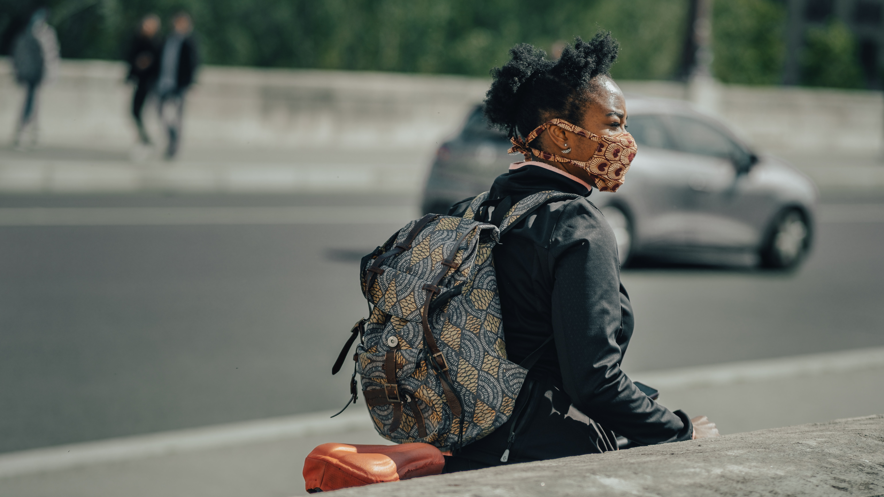
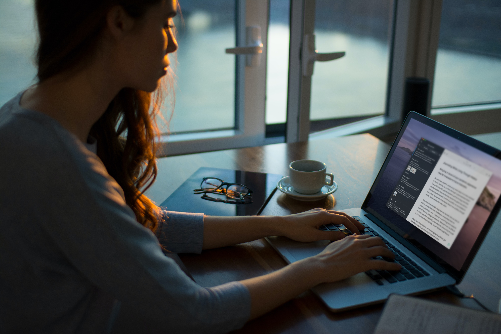

## Keeping a record of your pandemic experience may be invaluable to future historians.

As has been noted in nearly every email many of us have received in recent months, we are living through “unprecedented times.” The confluence of a global pandemic and technology that links communications and communities across the globe has led to a months-long environment of a bit of a duality: we are isolated in our homes, but we are nevertheless tied to one another, through words, social media, and video chats.

This period has brought many new mechanisms into our lives as well as, undoubtedly, new challenges, new perspectives on existing challenges, and — hopefully — some long-term solutions that will make us stronger as a people. Although it can be difficult to reflect upon the gravity of a moment when one is living through it, it is no secret that in actuality, we are living through history.

Many historians, therefore, are encouraging the public to get actively involved in documenting this period of time.

Documenting history as it’s unfolding doesn’t necessarily mean drawing conclusions, making big sweeping observations about the state of things, or having any answers. Instead, it means keeping a record of your own experiences, in real time and with the perspective you have at that very moment.

This is different from looking back. When we look back, we’re reflecting with information and perspectives that weren’t available to us at the time an event was happening. Contemporaneous writing offers a more intimate look at how thinking, processes, and solutions evolved.

*“As historians, we rely on those daily reports to figure out what actually happened on the ground,”* Victoria Cain, an associate professor of history at Northeastern University, [told The Boston Globe in March](https://www.bostonglobe.com/2020/03/22/metro/journaling-during-pandemic-yourself-historians/), just as the pandemic was gaining steam in the United States. *“It really offers us insight into how society and culture worked at a time of tragedy, or crisis, or just chaos.”*

Around the same time Cain gave those remarks, Mary Warner, the executive director of the Morrison County Historical Society in Little Falls, MN, [issued a call to locals in her region to start their pandemic journals](https://morrisoncountyhistory.org/?p=7948).

*“As we are sliding into hunker-down mode, a number of historians (including me) got to thinking about how we can document this time of COVID-19,”* wrote Warner on a blog post on the historical society’s website. *“We, along with the general public, recognize that we are living in a truly life-changing historic moment. There will be news and government sources documenting many of the public aspects of the pandemic and these will likely end up in some sort of archive or museum, one that is probably digital given how much happens online today. Historians will use these sources to piece together the larger context of what happened during the COVID-19 pandemic, but we also need stories from individuals, the personal accounts of what it was like to live through this time.”*

Warner noted that doing so doesn’t have to be a chore, nor does it have to be too big a commitment. She notes all one really needs is a blank notebook or a computer to keep track of their thoughts, and offers prompts that people may consider writing about in their pandemic journals. They include:

- Observations about what is happening in society as a result of the pandemic (like people buying up all the hand sanitizer, bleach, toilet paper, and, the latest, flour, or the financial markets taking a dive, or people losing their jobs),
- Your symptoms if you happen to get sick and have the energy to do so. The symptoms of others if they get sick.
- How you are altering your habits, work life, and living arrangements to cope with the situation,
- The new ways you are learning to socialize, including the technology you use to keep in touch,
- How you are coping with having children home (if this is your situation)
- How your pets are coping with having you home
- How you are coping emotionally with social isolation and fear related to the pandemic

It should be noted that no time is too late to start a pandemic journal. In many places, the pandemic still rages on, months and months after the onset, and its effects will likely linger for years, if not longer. Reflections about this period of time and how it is manifesting in your specific world may give future historians a real window into an experience they otherwise may not have had.

Beginning the practice of writing in a pandemic journal is similar to starting any journaling practice. You can find success by committing to a certain level of journaling at some frequency. Perhaps it’s five or ten minutes a day, perhaps it’s once a week. Whatever works for you and whatever you think you can really keep up with and commit to is what you should pursue. The most important thing about journaling, regardless of whether you’re capturing history-in-motion or not, is that you stick with it.

Like Warner in Little Falls, MN, the directors of historical societies across the country and globe will be interested in the written records of people’s experiences during this time. If you feel so inclined, once you have a record kept, it’s worth reaching out to your local historical society to see if your writings may be of any service. It’s likely they will welcome your record with open arms.
