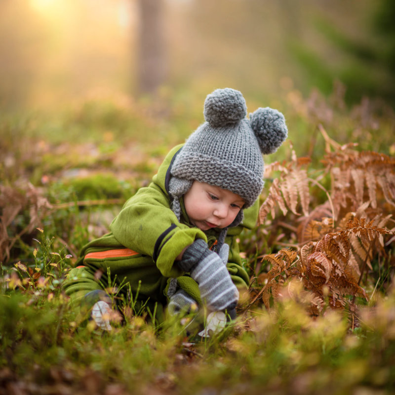

## Children need to hear positive affirmations from the people they look up to

Children, arguably, are in a constant state of flux. Though routines anchor children, they are by nature working to make sense of the world around them and find their place in it. Children need cues from the adults around them to find grounding energy as they navigate finding their place in the world. Adults need to lead by example. Children follow our lead.

When it comes to how we relate to children, the biggest question we must ask ourselves is: “What is my goal as a parent or guardian?” For many, that goal is to foster growth of a child who is confident, open, and happy — the best version of themself.

We can encourage this type of positive growth by being aware of the things we say to our children, the intention behind those phrases, and the impact of them.

Below are ten phrases that are said to help children feel confident, stable, and content. Hearing these things from parents, guardians, and other positive adult role models can bolster a child’s image of self-worth and can help forge stronger bonds between adult and child.

1. “You can do it, I believe in you.”

For a child, knowing that an adult believes they’re capable can do amazing things for their self-esteem, and the effects of these confidence-boosting moments can last for many years. When a child has the confidence to try something new or challenging, and they succeed, the effects are cumulative — that success will encourage the child to try something challenging again.

2. “What would you like to do?”

Giving your child the choice of what to do encourages them to get in touch with their preferences and to advocate for what they want or what will ultimately make them happy. This doesn’t have to be a big deal — it could be as simple as, “Would you rather go to the park, or to the store?” But giving your child ownership over the decision and letting them steer the direction of an activity is an important way to build confidence.

3. “What do you think?”

Talking to your child about something and asking them for their opinion is a great way to let them know that their opinions, feelings, and thoughts matter — not just to you, but to the whole world. You may also be surprised at their perspective on whatever it is you’re talking about. Children have a way of seeing the world in ways that adults sometimes can’t.

4. “Tell me more!”

When a child is telling you a story or something about their day, it can do wonders for their confidence if you let them know you’re interested, by encouraging them to tell you more of the story. You can ask questions, or just really display your enthusiasm for what they’re saying.

5. “I’m sorry.”

Adults make mistakes, just like anyone else. Sometimes we are caught up in our own energy, and we end up being short, or rude, to our kids. If this happens to you every now and then, don’t beat yourself up about it too much — as long as it’s not our regular way of being, it’s just a part of life. However, you should consider apologizing to your kids when you have been unfair to them. Doing so not only validates your feelings for them (and lets them know that the way you were acting isn’t indicative of your overall feelings about them), but it also displays for them the importance and power in apology.

6. “I love you.”

You show your kids how much you love them every day, and it might very well be apparent to you that you love them. However, it never hurts to let them know. Tell them you love them often. It’s not a phrase that is ever bad to repeat.

7. “I love spending time with you.”

Letting your kids know that time spent with them is something you enjoy, not just something that happens passively, can remind them of their own self-worth and of your love for them.

8. “That was brave!”

When your child does something that is challenging or requires them to go out of their comfort zone, point out to them how brave it was to take that on. Acknowledging bravery doesn’t have to be about giving them your approval, but instead, it can be a way of telling them you know that what they did was hard and, human to human, you’re acknowledging that difficulty and celebrating it.

9. “You should be very proud of yourself!”

Taking pride in one’s own achievements is something that many adults struggle with. Perhaps this paradigm could shift if we encourage our children to take pride in what they accomplish! Like lauding bravery, this isn’t about doling out your approval (“I’m proud of you,”) but rather about encouraging your child to approve of, and take pride in, themselves.

10. “Thank you.”

When your child does something nice or thoughtful, or when they help you when you’ve asked them to, it is important to say thank you. Sometimes it can be hard to remember that our children need to hear the same expressions of gratitude that we extend to people who aren’t within our families. Expressing gratitude reminds your child that you are appreciative of them, and getting positive feedback for doing something nice has a multiplying effect. It feels good to be thanked, which makes us go out of our way to do something nice or helpful again.

Thank you for reading. If you’ve said any of the phrases above recently, that’s great. Your instincts have guided you and will continue to. As any parent, guardian, or adult who is close to a child will know, raising children is no easy task! Your dedication to your children is evident simply in your willingness to read this article.
