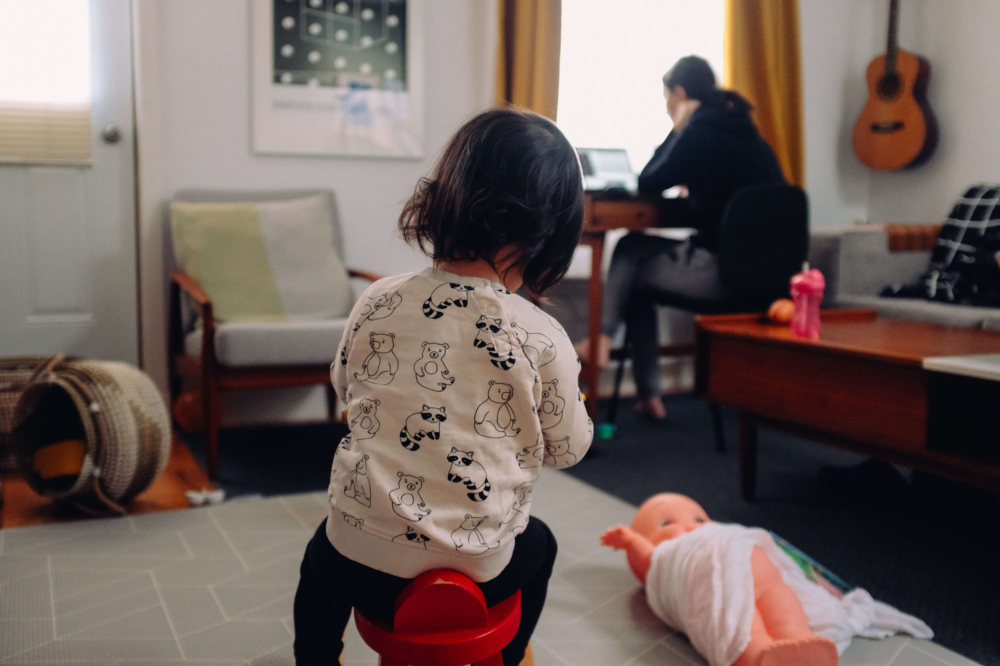
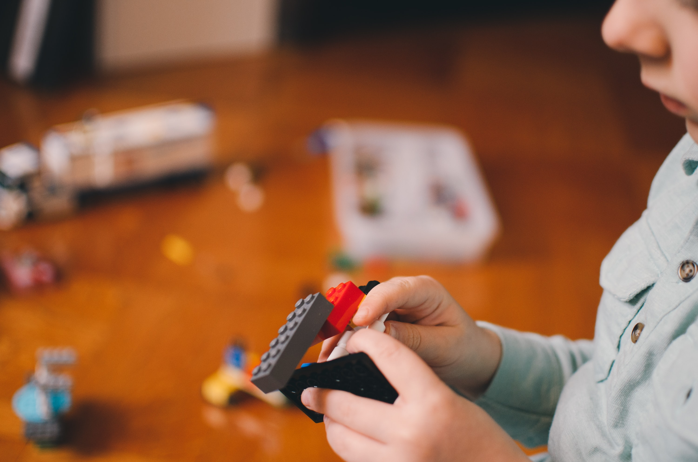

### The COVID-19 crisis has forced many professionals, and their kids, to stay home full-time, presenting new challenges

It was mid-March when, for many professionals in the US, particularly in the northeast, some tried and true systems vanished overnight. The first: the office — a space where professionals have long retreated for focus and work. The second: school — a place where those professionals’ children spent their days learning and occupied, away from their parents.

Parents and their children were subsequently told to move their operations into the home. For parents who had jobs for which remote work possible, that meant taking their computers, conference calls, and a suddenly-booming Zoom schedule home. For school-aged kids, it meant logging onto the computer for remote learning through school. And for little kids, it meant all the imaginative play, snack times, and general time being a kid that once was happening at a childcare center or preschool was now happening at home.

Parents who were trying to juggle work and children suddenly found themselves amid a major conflict. How does one get anything done when their kids are at home?

For those who are in the loop with other professional parents via social media, it’s been no secret that this period has proven to be a struggle. With cases of the virus blossoming across the US and with states debating whether or not to resume in-person instruction and childcare operations in the fall (a period that has also been acknowledged as a possible “second wave” of the virus — though many experts say the first wave still hasn’t ended), parents are facing an uncertain question: how long do I need to keep juggling work and children, and can I sustain this?

Below are some of the strategies that some parents have employed to make the best of a situation that is undoubtedly challenging for all. The list below is not meant to be prescriptive; it’s clear that not all of these options are available to or possible for every family. However, knowing what other families have done in the face of this challenging period could help bring to light some solutions.

## 1. Hire a trusted babysitter

A friend of mine hired a babysitter to come into her home for half of the workday every day so that she and her husband, who were both juggling full-time jobs, could each have uninterrupted work time. She referred to her family as “monogamous” in this sense — they were only “seeing” one babysitter, and the babysitter had assured them that she was not sitting for other families and was remaining fairly isolated herself in her day-to-day life.

Hiring help can prove challenging, of course. Families where one or more family members are at high risk for serious complications for COVID-19 may not be able to invite someone outside their immediate family into the home, regardless of how much that person insists they’re staying safe. In addition, cost can be a factor. In some regions, childcare facilities have continued to charge families despite childcare being closed, which makes hiring additional help a challenge or an impossibility for some.

## 2. Split work time with a partner

Again, a big caveat — this is not a possibly for everyone, because they don’t share parenting with someone else or because their partner has a job. For those it is possible for, though, my own family has found that strictly splitting work hours works a lot better than trying to share the whole day with our kid in the room. I work in the morning, my partner works in the afternoon. The four to five uninterrupted work hours I can spend are ultimately a lot more fruitful than if I try to spend the whole workday juggling parenting and childcare.

## 3. Use family as a resource

Some families in my community have made the decision to move in with older, retired family members in order to quarantine safely with some childcare availability. This requires the younger family to quarantine themselves two weeks before arrival, and, of course, there can be some tension when pooling households that are typically independent of one another.

## 4. Other ideas

All the above are big concepts that, as noted, might not be doable for everyone. Here are some smaller, perhaps more attainable approaches to consider implementing:

- Make one area of the house your work area. This could be your bedroom, a section of a counter, or a desk. Let that area be where you work, rather than taking the laptop to the couch where the rest of the family is. Even if it’s in the same room as everyone else, it can help focus to have one space you return to.
- Give kids some quiet activities they can engage in when you have to be on the phone.

- Give yourself some rituals you can work into your own quiet time — journaling, meditation, or even reading a book or watching TV. Juggling work and kids means you’re hyper engaged all day long. Unwinding and taking care of your own mental health has never been more important.

Whatever systems you put in place for yourself to make this very challenging time a little easier, we wish you the best, and we definitely feel your pain!
