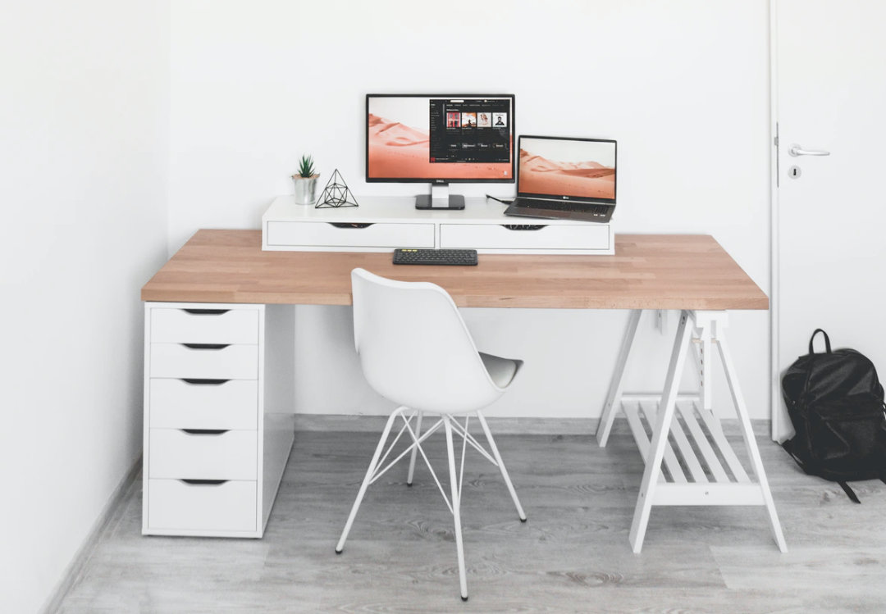

### Working from home has become the new norm. How can you be most successful at it?

This spring, professionals across the globe found their daily routines, and environments, suddenly upended as offices of all ilk close their doors and asked employees to work remotely due to COVID-19.

Many professionals took to their couches, seeing the break as a blip. However, as time has gone on, the arrangement may be more permanent than initially thought. Large parts of the US continue to struggle with COVID-19 outbreaks. Meanwhile, some large employers have decided that for the sake of efficiency and their bottom line, they’re going to [switch to remote work indefinitely](https://www.nytimes.com/interactive/2020/06/09/magazine/remote-work-covid.html).

I’ve been working from home for the better part of ten years, and over those years, I’ve found some very simple things I can do to make my workdays as productive as possible. If you’re struggling with productivity, these may work for you, too.

## Get an ergonomically-suitable workspace setup

Yes, it’s fun that we can work from our couches, armchairs, and even beds — but, should we? Some professionals find their productivity dips if their body is in a lounging position. If you are struggling with productivity, it could be because of where you’re sitting. If working from home looks like it’s going to be a long-term arrangement for you, it makes sense to invest in a desk and a desk chair so that you can sit up, work comfortably, and find focus at your work station.

## Get dressed

Yes, we’ve all heard the Zoom meeting jokes — *“Are you wearing pants? I can only see your top half.”* Hah, hah, hah. In all seriousness, although for the most part we can work in our pajamas when we’re working from home, I’ve never found it to be the best approach.

For me, my productivity is largely impacted by my mindset, and that means I need to get into the mindset of being amid a workday. Though I don’t get so dressed up I’m uncomfortable, I do take care to get dressed in the morning before starting my workday. My motto is that I should feel as though if I were to have to leave the house for some reason, I wouldn’t have to take a bunch of time out of my workday to prep myself for the outing.

## Keep a to-do list and stay on task

At home, there is sometimes a temptation to stray from tasks more than there is at the office. Surely I can pause this project long enough to fold some laundry, right? In truth, yes, that’s probably fine, as long as I’ve taken care to work it into my workday schedule. At the beginning of each day, I make a to-do list of the tasks I absolutely must get done that day for my work. Sometimes, if I have things in the house I’d like to give attention to throughout the day, I’ll make a secondary list of those tasks.

Since I’m a writer, most of my work is done at the computer. Sitting at the computer for too long of stretches can lead to me feeling pretty burned out, so I will sometimes intersperse active, housework-type activities between work to-dos. So, I’ll complete a few tasks, then load the dishwasher, then go back to work tasks.

## Set boundaries for yourself

The trouble with working from home is that sometimes it just feels like we’re living at work. When there’s no office to leave, it can be hard to decide the workday is done. For me, it’s helped to set firm hours for myself. For example, I begin no later than 9 am, and I close my laptop no later than 6 pm. Of course, this isn’t always possible, but even if I stick to it the majority of days, I find that I feel more balanced and I avoid careening toward burnout.

## Speaking of time, set an alarm in the morning

We’re saving a lot of time by not having to get ready to leave the house or commute to the office, but that doesn’t necessarily mean that sleeping until just before the workday starts is what’s best for our productivity. If you’re rolling out of bed and straight into a workday, chances are you’re losing at least some time at the start of the day to waking up.

You know yourself best. Are you groggy when you wake up? Do you have morning routines that make you feel grounded and ready for productivity? Just because you aren’t going anywhere doesn’t mean you should ditch your morning processes. Give yourself enough time to feel awake and ready by the time you sit down at your desk.

## Keep your space tidy

When everything is in disarray, we’re all the more likely to be unproductive and to follow temptations to skirt work for household duties. Do your best to tidy up in the evenings or in the morning before work so that once you sit down to work, you can do so without feeling distracted by the messes around you.

Whether your work from home experience is short-term or long-term, hopefully some of the tips above will help you find the most productivity, balance, and peace as you shift your routines. It’s never easy to change up the ways we do things, but with a little mindfulness and intentionality, we can make the transition all the easier for ourselves.
