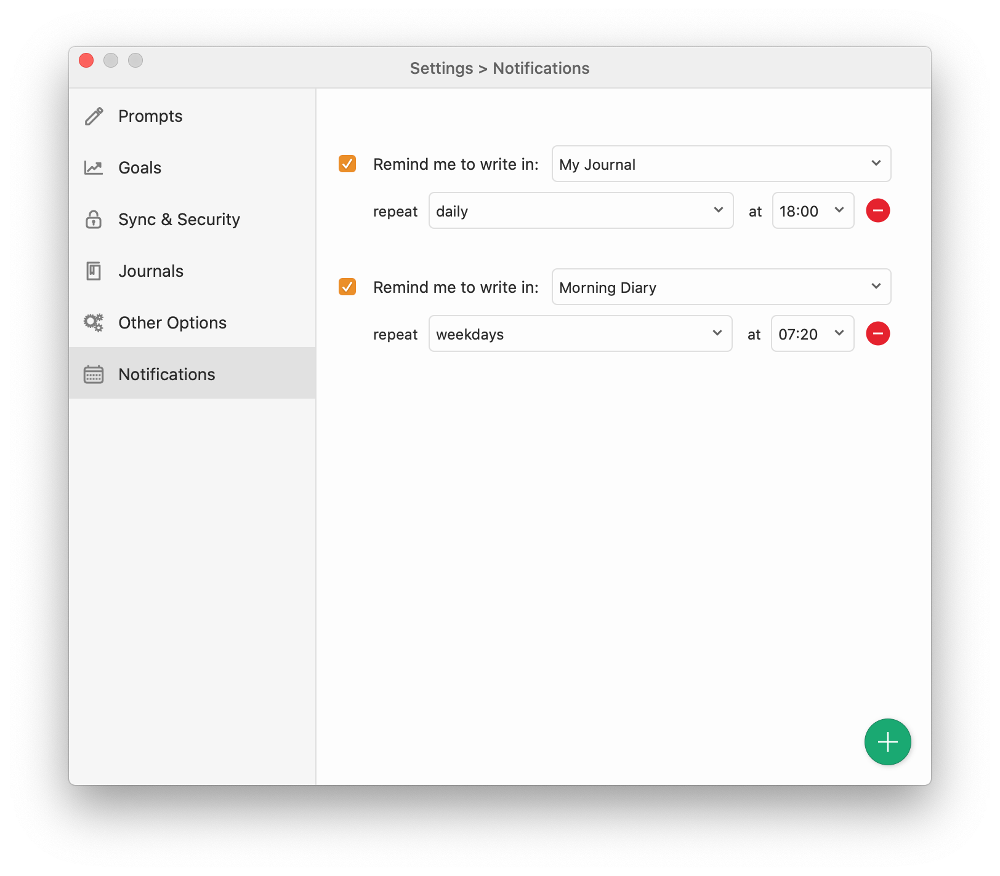

Notifications allow you to be reminded to write on a specified journal, on specified days, at a specified time.

Notifications can be customized to your preference. You can select a which journal to be reminded for (multiple journals only available for Diarly Premium), which days of the week you want to be reminded on, and the time of day when the notification should happen.

Use these customization options to make the most out of notifications and make them work for your goals and routine.

You can add as many notifications as you want.

To add another notification, click the green plus (+) button on the bottom right.

To disable a notification, turn off the checkbox to the left of it.

To delete a notification, click the red minus (-) button on the right of the notification.