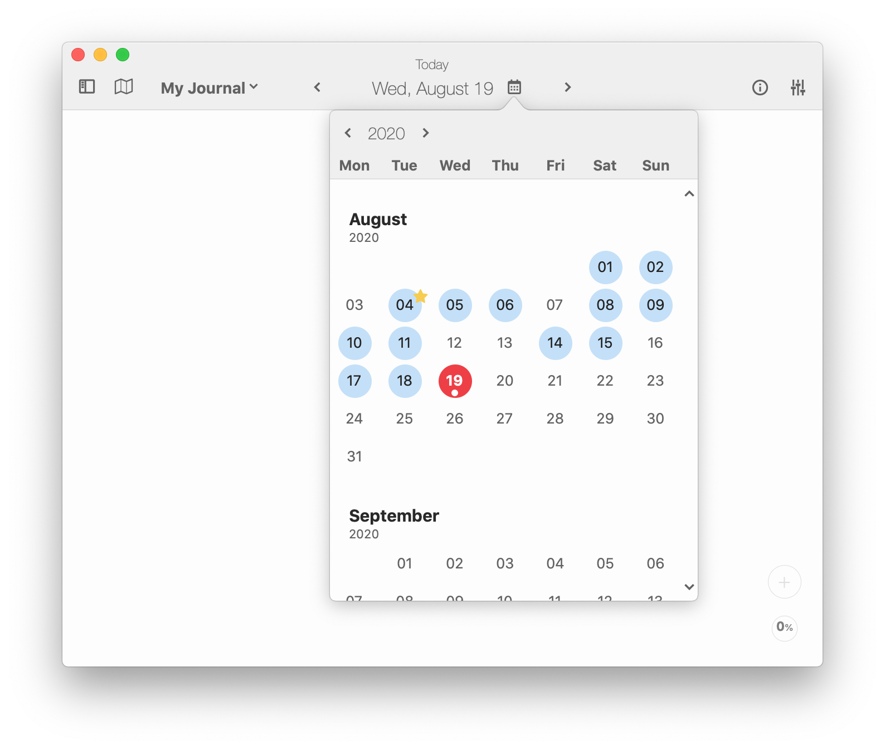
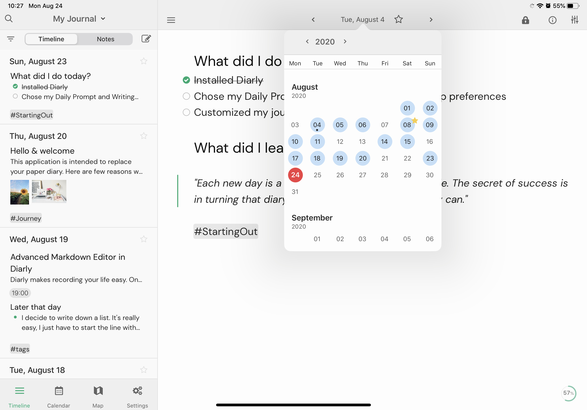

import { Icon } from '../components/icons/icon.js';

The **Calendar** <Icon icon="calendar" size="20" /> allows you to swiftly navigate between your notes across the timeline. Here you can see which days you have been journaling. If you select a day with no entry, the note is created for you automatically and you can simply start writing.

- **Today** is identified by a strong colored background behind the date. *The color depends on the currently selected theme.*
- Days in which you have **journaled** are identified by a soft colored background behind the date. *The color depends on the currently selected theme.*
- The **currently opened** entry is shown by a dot under the associated date.
- Days that have been **starred** in the list view show a star next to the date.

Navigate through **months** by scrolling up or down, and navigate through **years** with the arrows next to the year at the top left corner.

