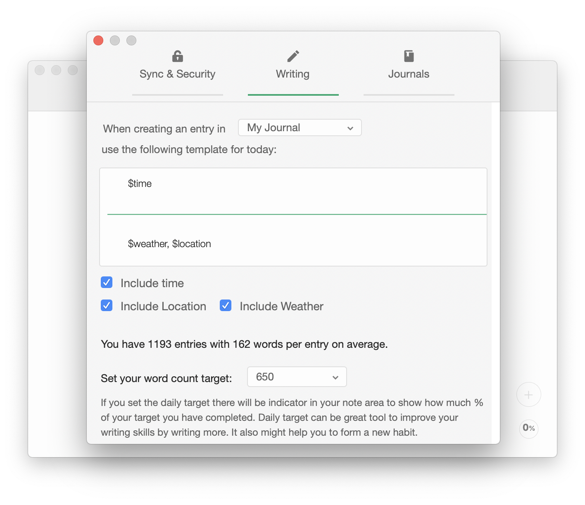

When you open Diarly and there is no entry for today, Diarly will use the template set in the preferences to create a new entry for you automatically.

Daily prompt allows you to use special keywords:

- `$time` will insert the current time (the time when the entry was created).
- `$weather` will read your current location, and based on that add the current weather forecast.
- `$location` will read your current location and insert it into the entry.
- `$calendar` will read today's events from the Apple Calendar app and insert them with practical time separators for each.

Diarly uses this template to create entry every time you start the app. If you want to use this template for other days you can use the shortcut `⌘⌃N` (command control N).
