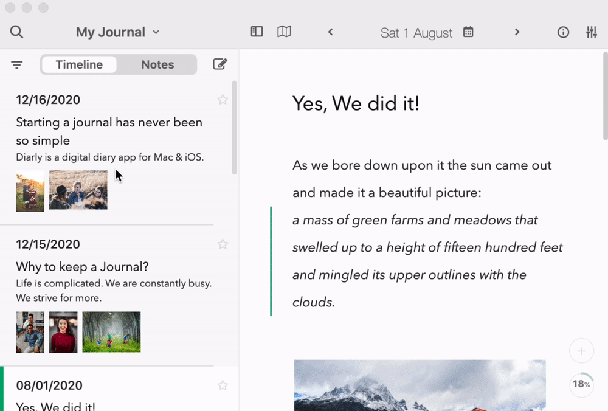

import { Icon } from '../components/icons/icon.js';


Diarly supports the following export options:

- Markdown
- PDF
- Rich Text
- Printing

You can export all your journals by going to `MenuBar > File > Export` and choosing the exporter.

## Markdown Exporter

Exports a zip file containing `.md` files, with images. Markdown is a widely used format for modern Blog and writing apps. 

The file structure of `Markdown` exporter:

```
Export 
  > Journal Name
    > Year (e.g 2020)
      > Data (contains all file attachments used in journal)
      - DD-MM-YYYY.md (plain text entry for given day)
      ...
```

When a note doesn't have a `date`, it will be exported as `{UUID}.md`.


## Exporting only selected notes

On Mac, you can select notes (select multiple by holding shift) and then right-click to export them:


