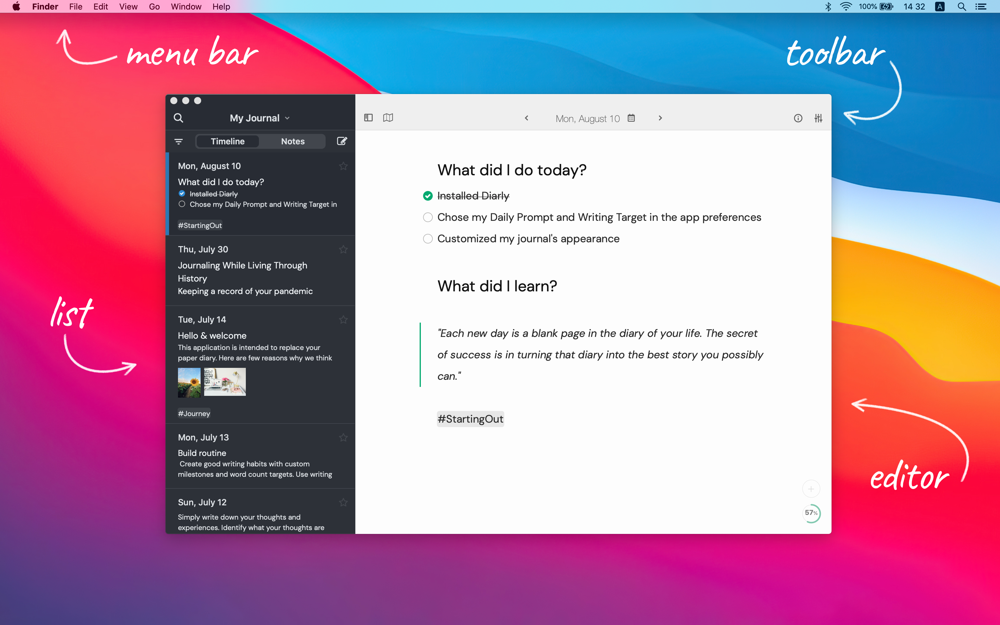
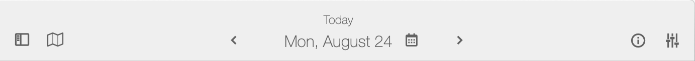
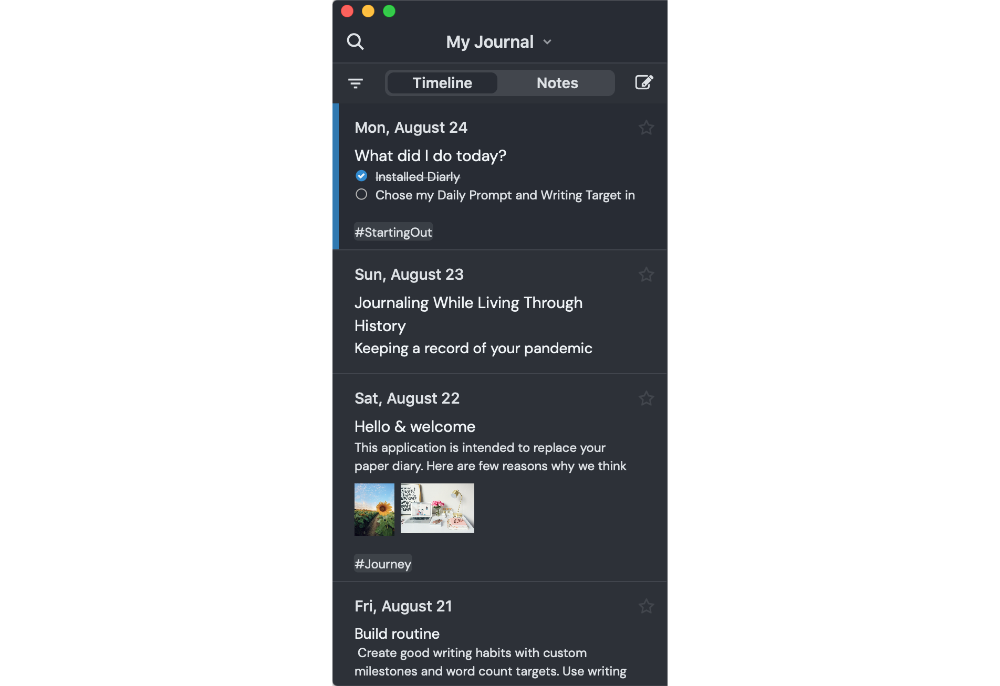
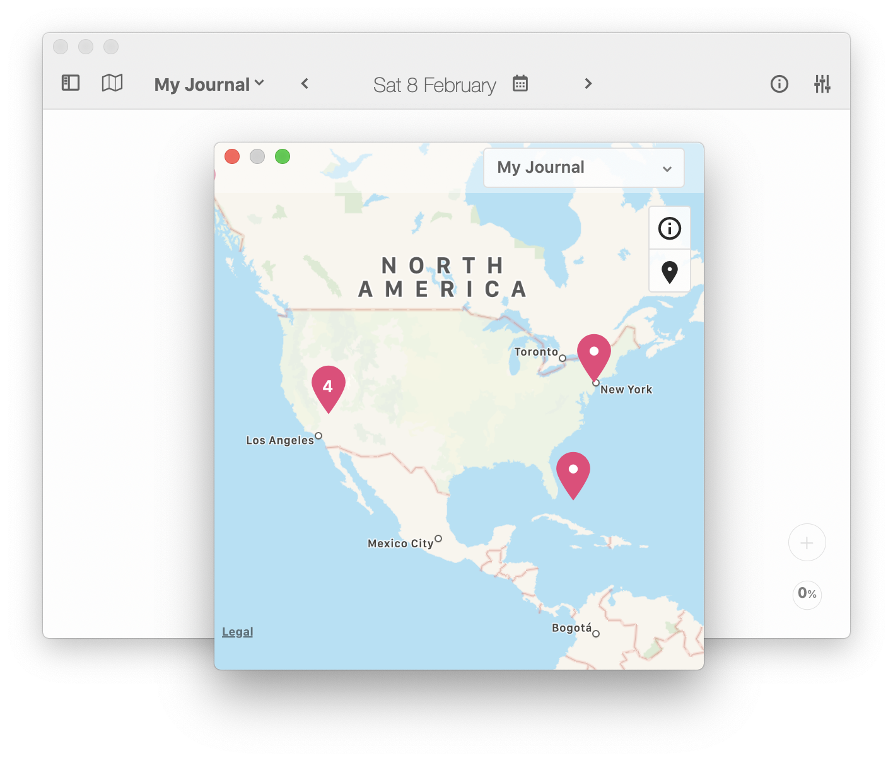

import { Icon } from '../components/icons/icon.js';

## Mac

### Overview

The main interface of the app is divided into the **menu bar**, the **toolbar**, the **list view**, and the **editor** shown below.

### Menu Bar

Like most other apps, the menu bar is where you'll find most options and settings. Most notably, under `Diarly > Preferences...` (`⌘,`) you will find the [App Settings](/help/settings).

### Toolbar

Here you'll find a few handy tools for your journaling needs. From left to right;

- The **show sidebar** icon <Icon icon="show-sidebar" size="20" /> will show and hide the sidebar, entering [typewriter mode](/help/typewriter-mode/).
- The **map** icon <Icon icon="map-o" size="20" /> will open the [Map View](/help/map-view/).
- In the center area, you will find the date of the currently opened entry.
  - The left icon <Icon icon="cheveron-left" size="20" /> will open the previous day's entry. If it doesn't exist, it will be created automatically.
  - The **calendar** icon <Icon icon="calendar" size="20" /> will open the [Calendar View](/help/calendar-view/).
  - The right icon <Icon icon="cheveron-right" size="20" /> will open the next day's entry. If it doesn't exist, it will be created automatically.
- The **information** <Icon icon="information-outline" size="20" /> will show information about the entry currently open.
- Last but not least, the **customization** icon <Icon icon="tuning" size="20" /> will show the [styling options](/help/styling-overview/).

### List View

In the list view you'll find the **timeline** with all your entries for the selected journal. Some key features of each entry are shown, like [attached images](/help/attaching-images/), [tags](/help/using-tags/), and the topmost content (title, text, tasks). This is where you can track your daily activities, thoughts, and progress.

Alternatively, you can select the **notes**, where you can store information without a specific date, like ideas, recipes, or projects.

The **search** <Icon icon="search" size="20" /> allows you to search through all your notes across all journals. It supports tags and special keywords. You can find out more about the [advanced search options](/help/advanced-search).

Next to it, you can select which [journal](/help/journals/) you want to open. Multiple journals are available to Diarly Premium users.

Below, you will find the **filter** <Icon icon="filter" size="20" /> which can be used to filter the current journal and find relevant notes easily. 

- **Starred** — shows only notes marked with a star.
- **Containing Photos** — shows only notes with attached photos.
- **On This Day** — shows only notes written on the same day of the year as today.
- **With Uncompleted Tasks** — shows only notes that have uncompleted tasks.

The filter also shows all your [tags](/help/using-tags/), so you can find related content.

On the right, the **new entry** <Icon icon="edit" size="20" /> will create a new entry for today. If an entry already exists, it will add to it a [time separator](/help/time-separators/) with the current time.

### Editor

The editor is the most **advanced** part of Diarly. It allows you to write your entries in plain text and have them formatted immediately. Learn more about [writing on Mac](/help/writing-on-mac/) and [writing on iPhone / iPad](/help/writing-on-ios/).

### Map View

You can use the Map View <Icon icon="map-o" size="20" /> to quickly find the notes you have previously tagged with a location.

There are multiple ways for adding the location into your entries:

- Add a link from Google maps
- Go into `Menu Bar > Format > Insert Location`.
  - **Pick Location** will allow you to select a location.
  - **Current Location** (`⌃ L`, control + L) will insert the current location.
- Insert an **image** which is geotagged. Diarly will read the geolocation and insert it.
