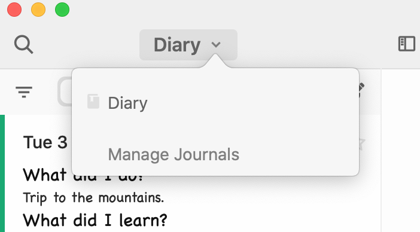
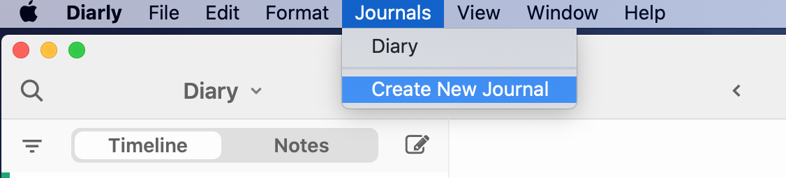
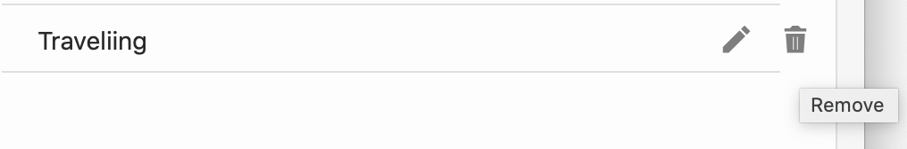
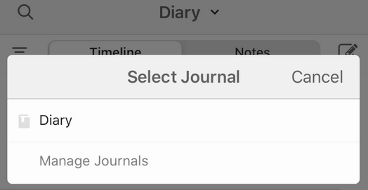
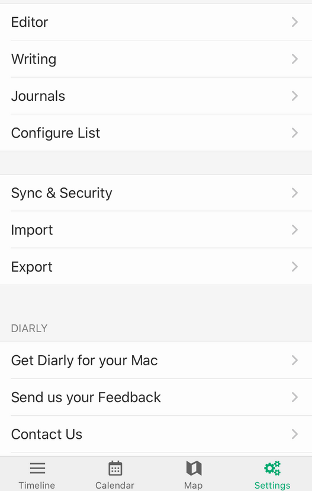
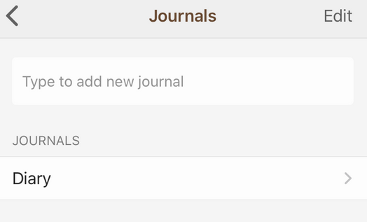
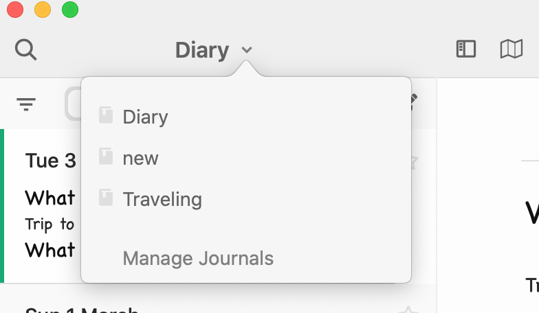

With Diarly Premium, you can create different journals for different purposes. For example, you could have different journals for mindfulness, travel, work, family, or personal notes.

**Tip:** the search option works across all the journals.

There are a few ways of accessing this option:

## Mac

- Click on the Journal Name displayed on the top of the sidebar, and choose **Manage Journals** at the bottom.

- Go to Menu Bar > Journals > Create New Journal.

- Go to Settings > Journals.

To remove a journal, go to the `Manage Journals` option and hover over the given journal. You will then see the **Rename** and **Remove** options.

## iOS

- Click on Diary in the toolbar and choose `Manage Journals`.

- Go to Settings > Journals

To remove a journal, go to Settings > Journals and swipe to the left on name of the journal that you wish to delete.

## Switching journals

To switch to another journal, click on the name of the journal to open the drop-down menu.

