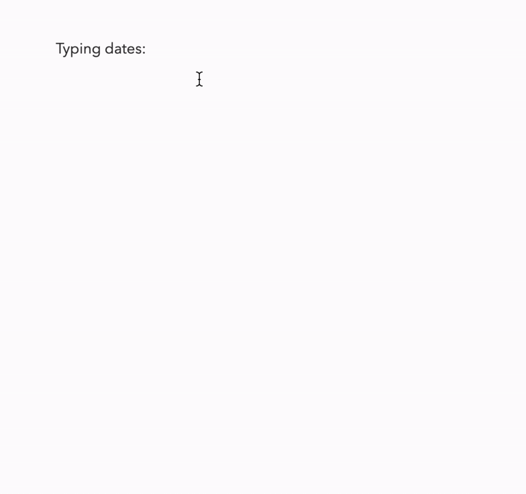

import { Icon } from '../components/icons/icon.js';

In Diarly, you can easily create links between your notes. On Mac, the application will detect when you typed the date and suggests creating a link:

On iOS and Mac, you can also copy the link directly from the list view:

Mac: `List View > Right Click > Copy link...`

iOS: `List View > Swipe Right > More > Copy Link..`

Once you added a link to your entry, you can click on that link to navigate to the corresponding entry.

Links copied this way can be used on other Mac & iOS apps, so for example, you can insert the entry link into your reminders app, and if you click on it, Diarly will be opened on that entry.
