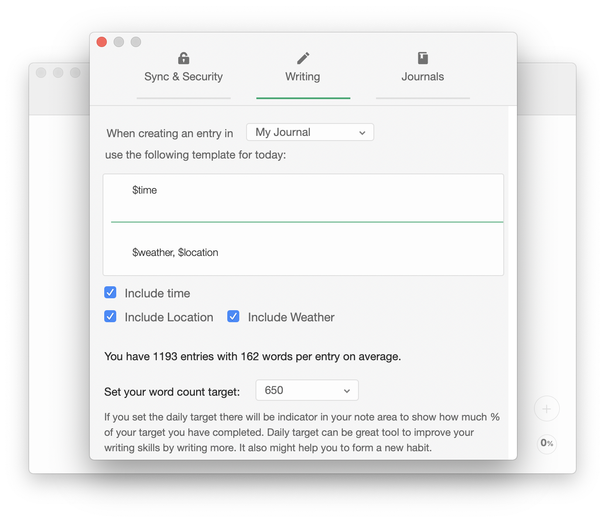

## Appearance

The app allows you to select one of the numerous fonts, as well as, edit the font size and line width. If you have a full version of the app, you can choose one of the custom themes provided in the app, as well as, create your own theme.

## Settings

Find the settings dialogue in `Menu Bar > Diarly > Preferences` or by using `⌘,`.

For example, you can change the text of a [new entry template](../Daily-Prompt) or [set the writing word count](../Writing-Goals-and-Statistics) goal.

If you have the **Premium Version**, there will be additional options available:

- **iCloud syncing** — you will be able to sync your entries with other devices using your iCloud account.
- **Encryption** — you will be able to encrypt all your entries so the password will be required to read them.
- **Multiple Journals** — you will be able to create more journals, each journal will have its own template for a new entry.

## List Configuration

You can configure the display of the list view.

