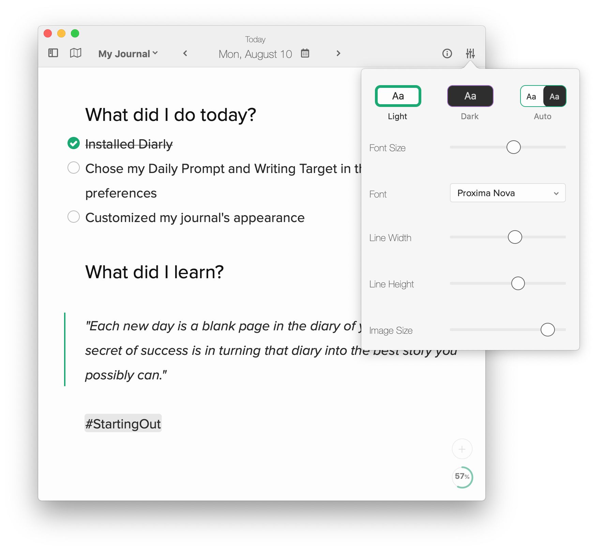

Diarly comes packed with themes to suit every moment.

In the free version, you have access to a light and dark theme. In the full version, you can access hundreds of light and dark themes.

You can set them to switch automatically with the System Preferences' Appearance settings.

