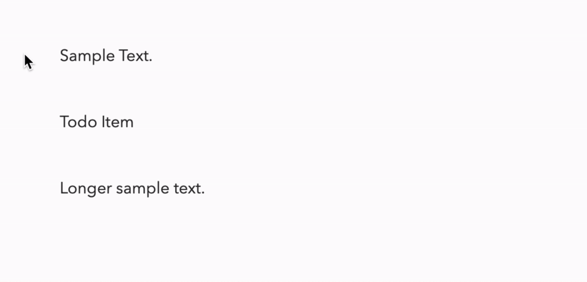

# Formatting popups

The full list of formatting options with shortcuts can be found in `Menu Bar > Formatting`. But diarly also lets you format by simply selecting the text and choosing the formatting options from the popup:

# Formatting just by typing

Diarly uses special characters to indicate the formatting of the text. This is known as [markdown](https://en.wikipedia.org/wiki/Markdown) - using special characters in your entry allows Diarly to store everything in plain text. 

Some of the characters modify the line, others only part of the text.

## Line modifiers 

Line modifiers start always as first characters of new line followed by white space.  Diarly supports following line modifiers:

- Headers - there are four levels: `# `  `## `  `### `  and `#### `

- `* `   List item

- `> `  Quotations

- `[] ` Checklist item

- `[x]` Completed Checklist item

You can click on the modifiers list by clicking on checklist item to check/uncheck item.

Lists and checklists can be nested - you can use `cmd [` and `cmd - ]` to pick level.

##  In-line text modifiers

Those are `**Bold**`,  `*Italic*`,  `__Underline__`   `::marked::`  You can use them anywhere in the text, not just at line start.

## Links and rich Media

You can create links to websites using the following format:

`[Link to Amazing Website](http://amazing-website.com)`

You can also select the text you want to convert into a link and paste the link.

